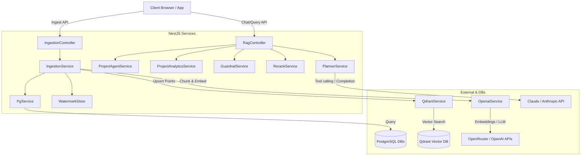

# RAG AI Technical Documentation

This document provides a comprehensive technical overview of **RAG AI**, a standalone NestJS-based RAG (Retrieval-Augmented Generation) and Planner Agent service designed to query and analyze project data.

---

## 1. System Overview & Tech Stack

RAG AI acts as an intelligent intermediary layer that bridges relational databases containing project information (Leads, Projects, BOQs) with LLMs and a vector database for semantic search and exact analytical computations.

### Technology Stack
*   **Backend Framework:** NestJS (TypeScript)
*   **API Documentation:** Swagger OpenAPI (`/docs`)
*   **Vector Database:** Qdrant (for semantic search & metadata filtering)
*   **Relational Database:** PostgreSQL (Lead Service & BOQ Service databases)
*   **LLM Providers:** Claude (Anthropic API) & OpenRouter (OpenAI-compatible endpoints)
*   **Embeddings:** Gemini / OpenAI API (via OpenRouter)
*   **Reranker:** Cohere Rerank API or custom reranking

---

## 2. System Architecture



---

## 3. Core Modules & Controllers

### 3.1 `RagController` (Chat & Query Interface)
Exposes the main query interfaces for users and planners:
*   **`POST /rag/openai/chat`**: The main chat endpoint. It handles routing automatically:
    *   *Analytics Queries* (e.g. totals, counts, averages, top-N) are routed to a deterministic DB analytics tool.
    *   *Structured Filters* (e.g. area range, value range, city, owner, zone) are evaluated using a custom parser and executed as deterministic Qdrant scroll-filters (directly outputting markdown tables to avoid LLM hallucination).
    *   *Semantic/Conceptual Queries* are routed to Qdrant semantic search, reranked, and answered using the LLM with context.
*   **`POST /rag/planner`**: An agent-style loop (`PlannerService`) that iterates dynamically using tool-calling to resolve complex queries.
*   **`POST /rag/agent`**: A deterministic query generator that translates user questions into exact database parameters.
*   **`POST /rag/projects/analytics`**: Direct database analytics interface.

### 3.2 `IngestionController` (Data Pipeline)
Manages pulling source data, transforming it into documents, and synchronizing it with Qdrant:
*   **`POST /rag/ingest/backfill/:source`**: Pulls historical data for a source (projects or BOQs) for a defined period (default 6 months).
*   **`POST /rag/ingest/sync/:source`**: Incremental sync pulling only rows updated since the last run (using watermarks).
*   **`POST /rag/ingest/entity/:source/:id`**: Real-time sync for a specific record. Typically called by webhooks when records are created or updated.

---

## 4. Ingestion Pipeline & Data Mapping

The ingestion engine is generic and source-agnostic. It reads data from PostgreSQL, maps it to clean Markdown strings, generates vector embeddings, and upserts them to Qdrant.

```
PostgreSQL (Source Tables) ──> Keyset Pagination ──> Markdown Document Construction ──> Embedding Model ──> Qdrant Upsert
```

### 4.1 Project Data Source (`project`)
*   **DB Source:** `ls_lead_projects` (Lead Service DB)
*   **Relations Folded:**
    *   `customer_info` (JSONB)
    *   `ls_project_commercial_summaries` (1:1 summary data)
    *   `ls_project_mis_summaries` (1:1 MIS details)
    *   `ls_assigned_resources` (Assigned team members and roles)
*   **Indexed Qdrant Payloads:** `docType` ("project"), `type` ("lead" or "project"), `projectId`, `accountId`, `customerId`, `projectCode`, `projectName`, `city`, `state`, `zone`, `areaSft`, `estimatedValue`, `team`, `updatedAt`.

### 4.2 BOQ Data Source (`boq`)
*   **DB Source:** `bs_boqs` (BOQ Service DB)
*   **Relations Folded:**
    *   `bs_rfqs` (RFQs status, cost, vendor)
    *   `bs_boq_workitems` (Line items count)
    *   Parent Project Identity details (`ls_lead_projects` name, company, city, owner)
*   **Indexed Qdrant Payloads:** `docType` ("boq"), `boqId`, `projectId`, `projectName`, `companyName`, `city`, `owner`, `customerId`, `boqCode`, `boqType`, `status`, `stage`, `cost`, `buyValue`, `salesCost`, `workitemCount`, `rfqCount`, `updatedAt`.

---

## 5. Query Routing & Search Flow

The `POST /rag/openai/chat` endpoint applies a hybrid routing strategy to select the most reliable execution path:

1.  **Guardrails:** Evaluates queries using `GuardrailService` to enforce safety/corporate policies.
2.  **Filter/Range Heuristics:** Parsers identify numeric ranges (e.g. `"area > 5000 sqft"`, `"estimated value over 1 cr"`), exact cities, owners, zones, and project codes.
    *   If filters exist, Qdrant's `scrollAll` fetches matching points.
    *   If it is a listing query, it is sorted and returned **directly** as a Markdown table (bypassing LLM generation to avoid format distortion and hallucinations).
3.  **Analytics Classifier:** Checks if the query asks for aggregates (sums, counts, averages). If yes, queries the `ProjectAnalyticsService` directly from Postgres and phrases the response with the LLM.
4.  **Semantic Search:** If no structured paths match, it queries Qdrant with the user embedding, sorts the hits, reranks them using `RerankService`, and sends the top context documents (up to 12,000 tokens) to the LLM.

---

## 6. The Planner Agent (`PlannerService`)

The **Planner** uses a ReAct (Reasoning and Acting) loop to answer complex multi-faceted questions:

1.  **Initialization:** The model receives the user's question, historical messages, and details on available tools.
2.  **Execution Loop (Max 5 Steps):**
    *   The LLM decides whether it has enough info to answer or if it needs to call a tool.
    *   **Available Tools:**
        *   `searchProjects(query)`: Performs semantic vector search + reranking over projects.
        *   `projectAnalytics(params)`: Runs deterministic Postgres SQL queries for exact calculations.
    *   The system executes the tool, records the trace, appends the result to the message log, and loops back to the LLM.
3.  **Final Response:** Once the LLM decides it has adequate context, it returns the final answer with a step-by-step tool trace.

---

## 7. Configuration Details

Configured via environment variables (found in `.env`):
*   `PORT`: Server port (default `3000`)
*   `DATABASE_URL_LEAD`: PostgreSQL Lead Service connection string
*   `DATABASE_URL_BOQ`: PostgreSQL BOQ Service connection string
*   `QDRANT_URL` / `QDRANT_API_KEY`: Connection info for vector database
*   `OPENROUTER_API_KEY`: API key for model synthesis & embeddings
*   `CLAUDE_API_KEY`: Direct Claude Integration API key (takes precedence over OpenRouter if present)
*   `COHERE_API_KEY`: Cohere Rerank service token
